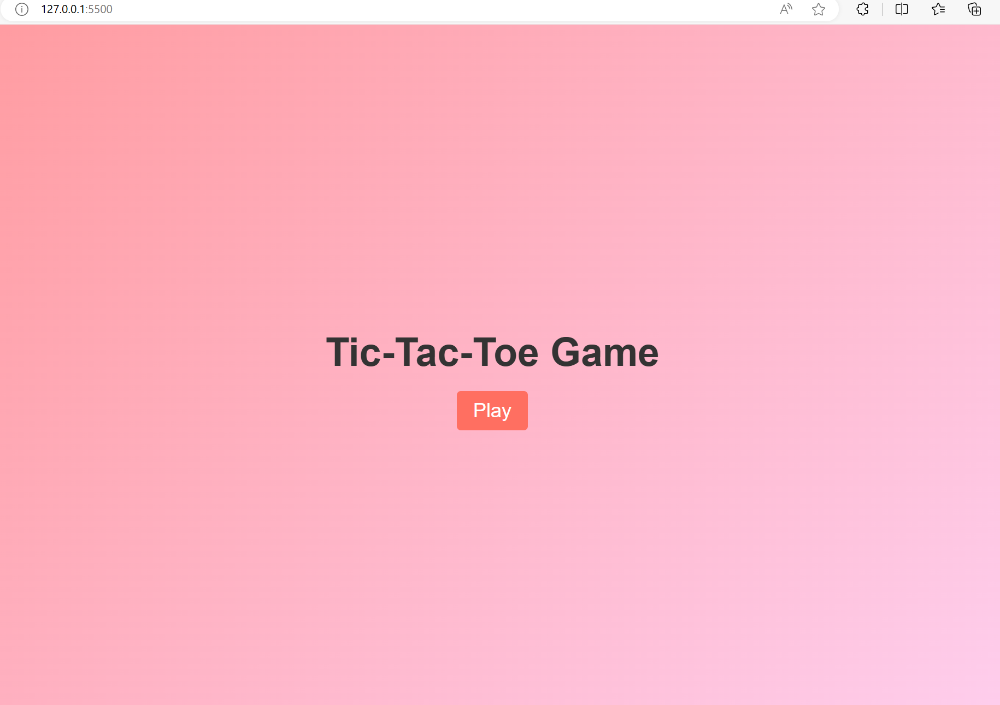
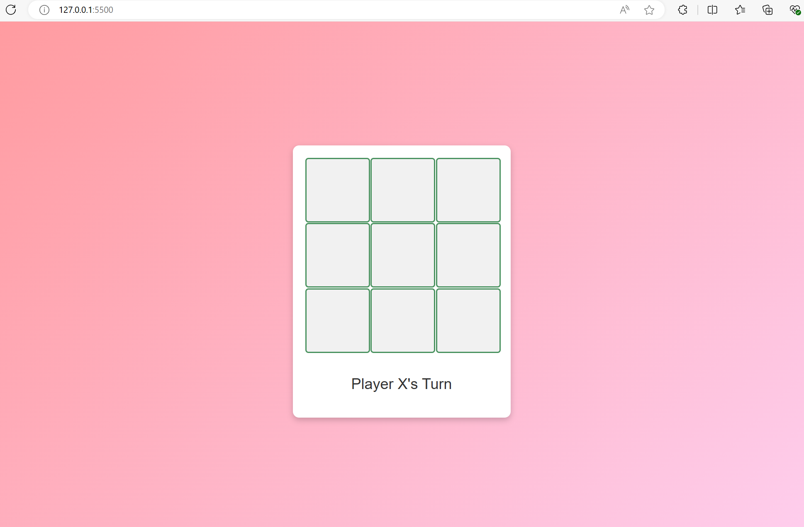
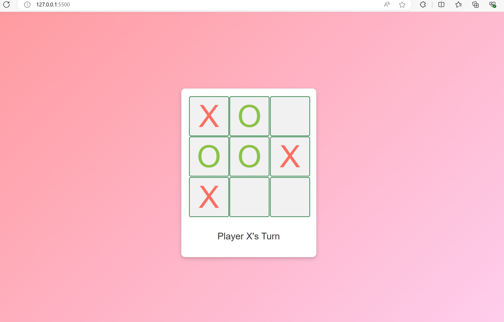
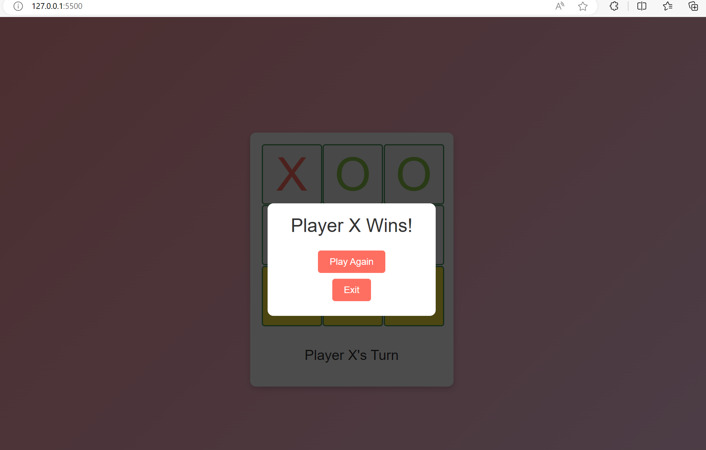

# Tic-Tac-Toe Game

## Project Description

A classic two-player Tic-Tac-Toe game implemented using HTML, CSS, and JavaScript.

## Project Objectives

- User-friendly interface for the game
- Implement game logic for two players
- Ensure responsiveness on all devices

## Files

- `index.html` - The game structure
- `style.css` - The game styling
- `script.js` - The game logic

## Author

- Anand Kumar Goswami \*

## Screenshot

## Instructions

1. Open `index.html` in a web browser to play the game.
2. Click on empty cells to make your moves.
3. The game will display the result when a player wins or the game ends in a tie.
4. Click the reset button to start a new game.

## License

This project is licensed under the MIT License.
